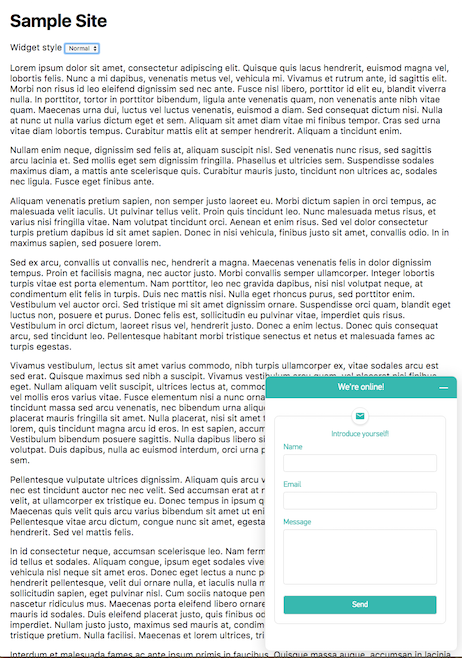
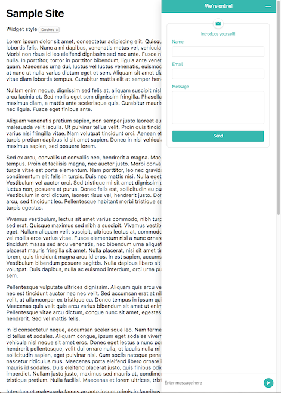

⚠️ Use of this software is subject to important terms and conditions as set forth in the License file ⚠️

# Zopim Web SDK Sample App

This sample app demonstrates how to build a simple chat widget using the [Zopim Web SDK](https://api.zopim.com/web-sdk).

The sample app is built using the [React](https://facebook.github.io/react/) framework and [Redux](http://redux.js.org/) architecture. However, you are free to use any other JavaScript framework to develop your own chat widget.

Screenshots:

| Normal                             | Docked                             |
| :--------------------------------: | :--------------------------------: |
|  |  |

## Getting Started
### Setup
You will need:
- [Node.js](http://nodejs.org/) at least version 4.5.0
- [npm](https://www.npmjs.com/)

Then run:
```
npm install
```
to install all the dependencies.

Next, download the latest version of the SDK (refer to the [Getting the SDK](https://api.zopim.com/web-sdk/#getting-the-sdk) section of the documentation). Make sure the file is named `web-sdk.js` and place it in the `vendor` folder.

### Running
To compile and run the sample app, run the following command:
```
npm start
```

This would open your browser pointing at [127.0.0.1:8000](http://127.0.0.1:8000).

### Configuration
To set your Zopim account key, navigate to the configuration file at [`src/config/base.js`](src/config/base.js).

Modify the content of the file as follows:
```javascript
export default {
	ACCOUNT_KEY: 'YOUR_ACCOUNT_KEY'
}
```

## Compiling the Widget
To compile the the widget, run `npm run dist`.

At the end of the compilation, you can find the widget at `dist/assets/widget.js`, which you can now use to embed in your website via a `script` tag as follows:

```html
<script type="text/javascript" src="/path/to/widget.js"></script>
```

## Contributions
Pull requests are welcome.

## Bugs
Please submit bug reports to [Zendesk](https://support.zendesk.com/requests/new).

## License
Copyright 2016 Zendesk, Inc.

Licensed under the Apache License, Version 2.0 (the "License"); you may not use this file except in compliance with the License.

You may obtain a copy of the License at

http://www.apache.org/licenses/LICENSE-2.0

Unless required by applicable law or agreed to in writing, software distributed under the License is distributed on an "AS IS" BASIS, WITHOUT WARRANTIES OR CONDITIONS OF ANY KIND, either express or implied. See the License for the specific language governing permissions and limitations under the License.
